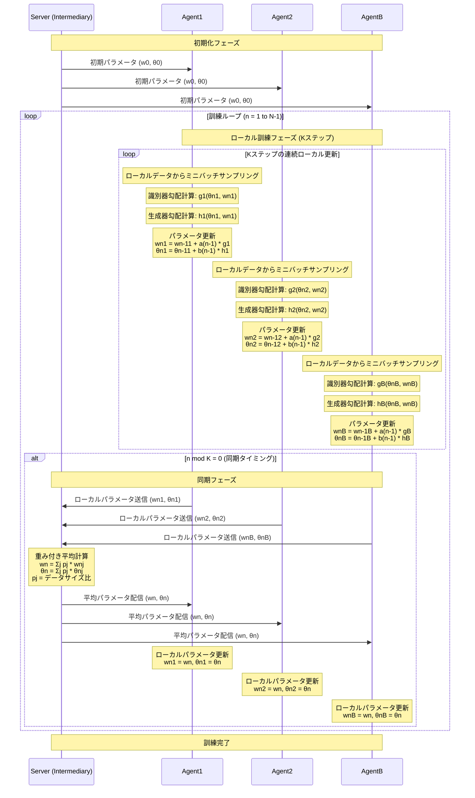

# FedGAN論文要約: 分散データのための連合生成敵対ネットワーク

## 概要

**FedGAN**（Federated Generative Adversarial Network）は、プライバシー制約と通信制約のある分散データソースに対して、非独立同分布（non-iid）データを使ってGANを訓練するアルゴリズムです。

## 論文の基本情報

- **タイトル**: FedGAN: Federated Generative Adversarial Networks for Distributed Data
- **著者**: Mohammad Rasouli, Tao Sun, Ram Rajagopal (Stanford University)
- **発表**: NeurIPS 2020

## FedGANの特徴

### 1. アーキテクチャ
- 各エージェント（データ所有者）が**ローカルな生成器（Generator）と識別器（Discriminator）**を保持
- **中間サーバー（Intermediary）**が周期的にパラメータを平均化して同期
- データは共有せず、モデルパラメータのみを通信

### 2. 通信効率
- 従来の分散GANと比較して通信量を大幅削減
- 同期間隔Kステップごとに通信（K=20がMNISTでの推奨値）
- 通信量は従来手法の1/Kに削減

### 3. プライバシー保護
- 生データを共有しない
- モデルパラメータのみを交換

## Algorithm 1: Federated Generative Adversarial Network (FedGAN)

### アルゴリズムの詳細

**入力パラメータ:**
- 訓練期間: N
- エージェント数: B（Agent1, Agent2, ..., AgentB）
- 同期間隔: K
- 学習率: a(n)（識別器用）、b(n)（生成器用）
- 初期パラメータ: w₀ⁱ, θ₀ⁱ

**処理フロー:**

1. **初期化**: 全エージェントが同じ初期パラメータで開始
2. **ローカル訓練** (各ステップn = 1, 2, ..., N-1):
   - 各エージェントiが独立してローカルデータを使用
   - 確率的勾配を計算:
     - 識別器勾配: g̃ⁱ(θₙⁱ, wₙⁱ)
     - 生成器勾配: h̃ⁱ(θₙⁱ, wₙⁱ)
   - パラメータ更新:
     - wₙⁱ = wₙ₋₁ⁱ + a(n-1) × g̃ⁱ(θₙ₋₁ⁱ, wₙ₋₁ⁱ)
     - θₙⁱ = θₙ₋₁ⁱ + b(n-1) × h̃ⁱ(θₙ₋₁ⁱ, wₙ₋₁ⁱ)

3. **同期処理** (n mod K = 0の時):
   - 全エージェントがパラメータを中間サーバーに送信
   - 中間サーバーが重み付き平均を計算:
     - wₙ = Σⱼ pⱼ × wₙʲ
     - θₙ = Σⱼ pⱼ × θₙʲ
     - ここで pⱼ = |Rⱼ|/Σₖ|Rₖ|（データサイズ比）
   - 平均化されたパラメータを全エージェントに配信
   - 各エージェントが受信したパラメータで更新

## MNISTデータセットでの実験結果

### データ分割
- **エージェント数**: B=5
- **クラス分布**: 各エージェントが2クラスずつ担当（non-iid分散）
- **同期間隔**: K=20
- **ネットワーク構造**: ACGAN

### 実験結果
- FedGANは実画像に近い高品質なMNIST画像を生成
- 通信効率性を保ちながら従来の分散GANと同等の性能を達成
- 同期間隔Kを大きくしても性能が安定（ロバスト性を確認）

## 理論的収束保証

### 収束条件
1. **等時間スケール更新**: a(n) = b(n)の場合
2. **二時間スケール更新**: a(n) ≠ b(n)の場合

### 主要仮定
- リプシッツ連続性
- 学習率の適切な減衰
- 確率的勾配の有界分散
- ローカル勾配と大域勾配の有界発散

### 収束証明
- FedGANの更新が中央集権型GANのODE表現に漸近的に追従することを証明
- non-iidデータ下でも収束を保証

## FedGANの処理シーケンス（Mermaidダイアグラム）

## 次に実施できること（実装提案）

### 1. 最小限動作プロトタイプの実装

#### 設計方針
- **Single-Process実装**: 複数のエージェントを単一プロセス内でシミュレート
- **Single-Loop**: 最初は1つの訓練ループで簡素化
- **フレームワーク**: TensorFlow/Keras

#### アクター設定
- **Server**: パラメータ平均化と配信を担当
- **Agent1, Agent2, AgentB**: 各々が独立したGANを持つ（3エージェント構成）

### 2. 実装に必要な決定事項

#### ハイパーパラメータ
- **同期間隔K**: 20（MNIST実験の推奨値）
- **学習率**: 
  - 識別器: a(n) = 0.0002
  - 生成器: b(n) = 0.0002
- **バッチサイズ**: 64
- **訓練エポック数**: 200

#### ネットワーク構造（MNIST用）
- **生成器**: 
  - 入力: ノイズベクトル（dim=100）
  - 出力: 28×28×1画像
  - 構造: Dense → BatchNorm → ReLU → ... → Conv2DTranspose
- **識別器**:
  - 入力: 28×28×1画像
  - 出力: 真偽判定（1次元）
  - 構造: Conv2D → LeakyReLU → ... → Dense

#### データ分割戦略
- **Agent1**: MNISTクラス0, 1
- **Agent2**: MNISTクラス2, 3  
- **AgentB**: MNISTクラス4, 5
- 各エージェントは独自のデータローダーを持つ

### 3. 追加で必要な情報

#### 損失関数の選択
- **標準GAN損失**: Binary Cross-Entropy
- **改良版**: WGAN-GP, LSGANなどの検討

#### 評価指標
- **FID Score**: 生成画像の品質評価
- **Inception Score**: 画像の多様性評価
- **可視化**: 生成画像のサンプル表示

#### 実装上の考慮事項
1. **同期タイミング**: モジュロ演算でK回ごとの同期を実装
2. **パラメータ管理**: 各エージェントのstate_dictを適切に管理
3. **重み計算**: データサイズ比に基づく重み付き平均
4. **収束判定**: 損失の安定化とFIDスコアの改善を監視

### 4. プロトタイプ開発手順

1. **環境構築**: TensorFlow、NumPy、Matplotlib等
2. **データ準備**: MNIST読み込みとnon-iid分割
3. **GANモデル定義**: Generator/Discriminatorクラス
4. **FedGANクラス実装**: Algorithm 1の直接実装
5. **訓練ループ**: ローカル更新と同期処理
6. **評価・可視化**: 生成画像とメトリクス表示

このプロトタイプを基に、段階的にマルチプロセス化、異なるデータセット対応、通信効率性の最適化などを進めることができます。