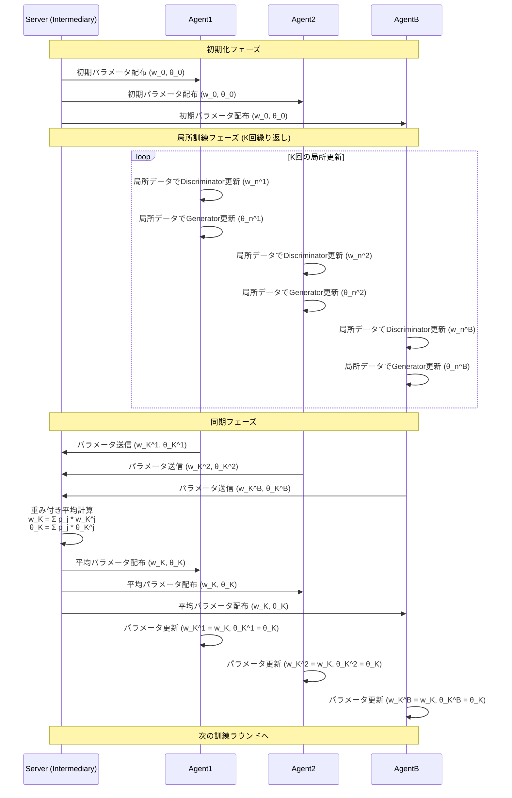

# FedGAN (Federated Generative Adversarial Network) 論文要約

## 概要

FedGAN（Federated Generative Adversarial Network）は、分散データソース間でのGANの訓練を、通信制約とプライバシー制約の下で実現するアルゴリズムです。従来の分散GANがGeneratorとDiscriminatorを分離していたのに対し、FedGANは各エージェント（Agent）に局所的なGeneratorとDiscriminatorの両方を配置し、仲介者（Intermediary/Server）を通じて定期的にパラメータを同期します。

## 主要特徴

### 通信効率の改善
- 各エージェントがK回の局所更新を行った後に、パラメータを仲介者に送信
- 仲介者は全エージェントのパラメータを平均し、各エージェントに配信
- 従来手法と比較して通信回数を大幅に削減

### プライバシー保護
- 生データを共有せず、モデルパラメータのみを交換
- 各エージェントのデータはnon-iid（非独立同分布）でも動作

### 理論的収束保証
- 確率的近似理論と通信効率的確率的勾配降下を用いて収束を証明
- 等時間更新と二時間スケール更新の両方で収束性を保証

## Algorithm 1: Federated Generative Adversarial Network (FedGAN)

### 入力パラメータ
- 訓練期間: N
- エージェント数: B = {1, 2, ..., B}
- 初期パラメータ: 各エージェントiの局所Discriminatorパラメータ w_0^i、局所Generatorパラメータ θ_0^i
- 学習率: a(n)（Discriminator用）、b(n)（Generator用）
- 同期間隔: K

### アルゴリズムの流れ

1. **初期化**
   - 全エージェントのDiscriminatorとGeneratorパラメータを初期化
   - w_0^i = ŵ、θ_0^i = θ̂ (全エージェント共通)

2. **局所更新フェーズ** (n = 1, 2, ..., N-1の各ステップ)
   - 各エージェントiが並行して以下を実行:
     - 局所データR_iから確率的勾配を計算:
       - g̃^i(θ_n^i, w_n^i): Discriminator用勾配
       - h̃^i(θ_n^i, w_n^i): Generator用勾配
     - パラメータ更新:
       - w_n^i = w_{n-1}^i + a(n-1) * g̃^i(θ_{n-1}^i, w_{n-1}^i)
       - θ_n^i = θ_{n-1}^i + b(n-1) * h̃^i(θ_{n-1}^i, w_{n-1}^i)

3. **同期フェーズ** (n mod K = 0の時)
   - 全エージェントがパラメータを仲介者に送信
   - 仲介者が重み付き平均を計算:
     - w_n = Σ(j=1 to B) p_j * w_n^j
     - θ_n = Σ(j=1 to B) p_j * θ_n^j
     - ここで、p_j = |R_j| / Σ|R_k|（エージェントjのデータ比率）
   - 仲介者が平均パラメータを全エージェントに送信
   - 各エージェントがパラメータを更新:
     - w_n^i = w_n、θ_n^i = θ_n

## MNISTデータセットでの実験結果

### 実験設定
- エージェント数: B = 5
- データ分割: 10クラスを5エージェントに分散（各エージェントが2クラスずつ）
- 同期間隔: K = 20
- ネットワーク構造: ACGAN（Auxiliary Classifier GAN）

### 結果
- FedGANは実データに近い高品質な画像を生成
- 従来の分散GANと同等の性能を維持しながら、通信回数を大幅に削減
- 同期間隔Kを増加させても性能が頑健に維持される

## FedGAN処理シーケンス図（Mermaid）



## 次に実施できること（プロトタイプ実装提案）

### 1. 最小限動作プロトタイプの設計

#### Phase 1: Single-Process基本実装
- **目標**: 単一プロセス内でFedGANの基本動作を確認
- **構成**: 
  - 1つのServerクラス
  - 複数のAgentクラス（Agent1, Agent2, AgentB）
  - 各AgentがローカルのGenerator/Discriminatorを持つ
- **データセット**: MNIST（簡略化版、各Agentが2クラスずつ）

#### Phase 2: 通信機能付きプロトタイプ
- **目標**: 実際の分散環境での動作確認
- **構成**: 各Agentを独立プロセスとして実装
- **通信**: REST API、gRPC、またはSocket通信

### 2. 実装時に決めるべき主要パラメータ

#### ネットワーク構造（MNIST用）
```python
# Generator
- 入力: ノイズベクトル (dim=100)
- 隠れ層: [128, 256, 512]
- 出力: 28x28x1 (MNIST画像サイズ)
- 活性化関数: ReLU → Tanh (出力層)

# Discriminator  
- 入力: 28x28x1画像
- 隠れ層: [512, 256, 128]
- 出力: 1 (真偽判定)
- 活性化関数: LeakyReLU → Sigmoid (出力層)
```

#### 訓練パラメータ
```python
# 基本設定
AGENTS_COUNT = 3  # Agent1, Agent2, AgentB
SYNC_INTERVAL_K = 20
TRAINING_EPOCHS = 100
BATCH_SIZE = 32

# 学習率
DISCRIMINATOR_LR = 0.0002  # a(n)
GENERATOR_LR = 0.0002      # b(n)

# 最適化器
OPTIMIZER = "Adam"
BETA1 = 0.5
BETA2 = 0.999
```

#### データ分割設定
```python
# MNIST 10クラスを3エージェントに分割
AGENT1_CLASSES = [0, 1, 2]  # 数字0,1,2
AGENT2_CLASSES = [3, 4, 5]  # 数字3,4,5  
AGENTB_CLASSES = [6, 7, 8, 9]  # 数字6,7,8,9
```

### 3. 実装で追加で必要な情報・決定事項

#### データ処理
- **正規化方法**: [-1, 1]範囲への正規化（Tanh出力に対応）
- **ノイズ分布**: 標準正規分布 N(0,1)
- **バッチサイズ**: エージェント間で統一するか個別設定するか

#### 同期メカニズム
- **重み計算**: 各エージェントのデータサイズに比例した重み付け
- **通信プロトコル**: パラメータのシリアライゼーション方法
- **エラーハンドリング**: 通信失敗時の対処法

#### 評価指標
- **定量評価**: FID (Frechet Inception Distance) スコア
- **定性評価**: 生成画像の目視確認
- **収束判定**: 損失関数の推移、生成品質の安定性

#### システム構成
```python
# ディレクトリ構造例
fedgan_prototype/
├── agents/
│   ├── agent_base.py      # 基底Agentクラス
│   ├── agent1.py          # Agent1実装
│   ├── agent2.py          # Agent2実装
│   └── agentB.py          # AgentB実装
├── server/
│   └── intermediary.py    # Server実装
├── models/
│   ├── generator.py       # Generatorモデル
│   └── discriminator.py   # Discriminatorモデル
├── utils/
│   ├── data_loader.py     # データローダー
│   └── communication.py   # 通信ユーティリティ
└── main.py               # メイン実行スクリプト
```

### 4. 開発ステップ

1. **Step 1**: Generator/Discriminatorモデルの実装とテスト
2. **Step 2**: 単一Agentでの局所GAN訓練の実装
3. **Step 3**: Serverの平均化機能実装
4. **Step 4**: Agent-Server間の通信実装
5. **Step 5**: 複数Agent協調訓練の実装
6. **Step 6**: 評価・可視化機能の追加
7. **Step 7**: パラメータ調整と性能最適化

このプロトタイプにより、FedGANの基本動作原理を理解し、より大規模な実装への足がかりとすることができます。