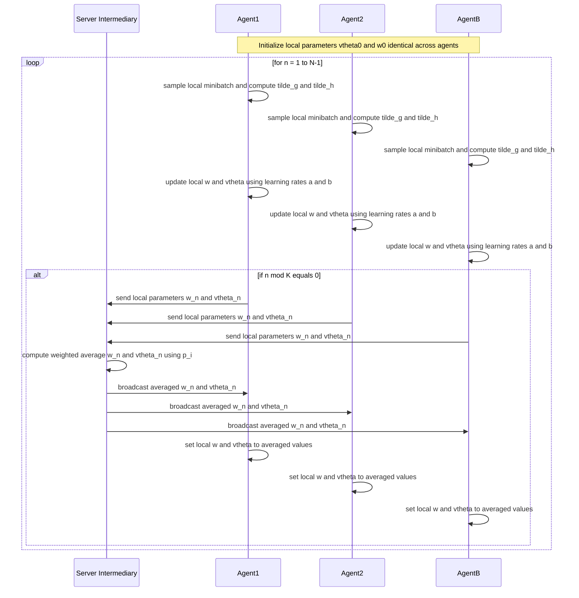

# FedGAN 要約（日本語）

以下は論文「FedGAN: Federated Generative Adversarial Networks for Distributed Data」から、特に「Algorithm 1: Federated Generative Adversarial Network」とその関連記載、ならびにMNISTに関する実験記述を抜粋・要約したものです。

## 目的
FedGANは、データが分散し非IIDである複数のエージェント間で、通信量とプライバシー制約を考慮しつつGANを学習するための手法です。各エージェントはローカルのジェネレータと識別器（discriminator）を持ち、一定間隔でパラメータを仲介者（intermediary, サーバ）に送信して平均化した後、同期されたパラメータを受け取ります。

## Algorithm 1 の概要（重要点）
- 訓練反復数: N
- エージェント: i = 1..B。それぞれローカルデータ集合 R_i を持つ。
- 各エージェントはローカルジェネレータパラメータ vtheta_n^i とローカル識別器パラメータ w_n^i を保持。
- 学習率: 生成器と識別器に対してそれぞれ b(n), a(n) を使用（同一でも可）。
- 同期間隔: K（各エージェントはKステップごとに仲介者とパラメータを交換）

処理（各イテレーション n=1..N-1）:
1. 各エージェント i がローカルミニバッチを使ってローカル確率勾配を算出: \tilde{g}^i と \tilde{h}^i（識別器/生成器に対応）
2. 各エージェントが並列にローカルパラメータを更新:
   - w_n^i = w_{n-1}^i + a(n-1) * tilde{g}^i(vtheta_{n-1}^i, w_{n-1}^i)
   - vtheta_n^i = vtheta_{n-1}^i + b(n-1) * tilde{h}^i(vtheta_{n-1}^i, w_{n-1}^i)
3. もし n mod K == 0 なら:
   - すべてのエージェントがパラメータを仲介者に送信
   - 仲介者は重み付き平均を計算（各エージェントのデータ量比 p_j を利用）:
     - w_n = sum_j p_j * w_n^j
     - vtheta_n = sum_j p_j * vtheta_n^j
   - 仲介者が w_n, vtheta_n を全エージェントに配信
   - 各エージェントがローカルパラメータを同期: w_n^i = w_n, vtheta_n^i = vtheta_n

注: 仲介者自体は学習を行わず、単に平均化の役割を果たす。

## 理論的性質（要点）
- 学習率やメモリ銀等の標準的仮定の下で、FedGANの平均化されたパラメータ列は中央集権的なGANの表す連続時間ODEに漸近的に追従することを示しています。
- Equal time-scale（a(n)=b(n)）とTwo time-scaleの両方で解析を行い、追従・収束の議論を述べています。
- 通信効率: 同期間隔Kを大きくすることで通信量を1/Kに削減可能。ただしKを大きくすると性能低下の可能性があることを指摘し、実験で頑健性を評価しています。

## MNIST に関する実験（抜粋）
- データ分割: MNISTとCIFAR-10はB=5のエージェントに分割。各エージェントは2クラスを担当（合計10クラス）。
- ネットワーク構造: ACGANを使用（論文のAppendixに詳細あり）。
- 同期間隔: K=20 を設定して実験
- 結果: FedGANはMNISTの生成で良好な画像を生成し、同期間隔K=20でも生成品質が維持されることを示しています（図: mnist_20.png）。

## FedGANの処理シーケンス（Mermaid、LaTeX特殊文字除去済み）
注意: Mermaidパーサーでエラーが出ないように、LaTeX特有の記法やバックスラッシュ、カンマ等の特殊文字は取り除きプレーンテキストのみを使用しています。

## プロトタイプ実装に向けた提案と次に実施できること
以下は、まずは最小限で動くプロトタイプを作るための提案です。Actorは Server (Intermediary), Agent1, Agent2, AgentB の4者で考えます。

1. 目標
   - シングルプロセスで動作するシンプルなFedGANプロトタイプを作成する。TensorFlow 2 を用いて実装。
   - 最初は Single-Process, Single-Loop で各 Agent をスレッドやループの中で順にシミュレートする方式で実装。通信は関数呼び出しで模擬。

2. 最小限の設計案
   - Agents: Agent1, Agent2, AgentB (合計 B=3) で開始するが、コードは可変にする。
   - Server: 平均化ロジックのみ（データを受け取らずパラメータの平均を返す）。
   - モデル: MNIST向けに簡易的なDCGAN/ACGANの生成器と識別器（軽量）
   - 同期間隔 K: 20
   - イテレーション N: 1000 から試行
   - バッチサイズ: 64
   - 学習率: generator 0.0002, discriminator 0.0002 を初期値として試す
   - 最適化: Adam, beta1 = 0.5

3. 実装上決めるべき値や追加で必要な情報
   - データの分割方法: 非IIDを模擬するため、MNISTのラベルをエージェントごとに割り当てる（例 B=3 の場合、ラベルごとに偏りを持たせる）
   - モデルのアーキテクチャ詳述: Number of conv layers, feature maps, activation functions, batchnorm の有無
   - 同期処理の頻度 K とローカルステップ数の対応: 1ラウンド内でのローカルステップ数 = K
   - 学習率スケジュールや二段階学習率(two time scale)を採用するかどうか
   - ローカル重み p_i の算出: 各エージェントのデータサイズに基づく

4. 実装フロー（簡単）
   - データ準備: MNISTをダウンロードし、エージェントごとに分割
   - モデル定義: 生成器, 識別器をTF Kerasで定義
   - Agent のローカル更新関数: ローカルバッチを使ってジェネレータと識別器の勾配計算とパラメータ更新
   - Server の平均化関数: 受け取ったパラメータを p_i により重み付き平均して返す
   - メインループ: N回イテレーションを回し、各Agentのローカル更新を行い、n mod K == 0のとき平均化を実行

5. テストケース
   - ハッピー系: 小さいネットワークと少量のデータで学習が進行することを確認
   - エッジ: Kを大きくして通信を減らした場合の出力品質変化を観察

## まとめと検証方法
- ここまでで論文のAlgorithm 1の流れとMNIST実験に必要な要点を抽出しました。
- まずはSingle-Processでエージェントをシミュレートする最小プロトタイプを提案します。
- 実装に必要なパラメータや設計上の決定事項を上に列挙しました。

## 次のアクション案
- 1) 提案した最小プロトタイプのコード骨組みを作成する (TensorFlow 2, Keras) 。
- 2) 最小動作確認用のユニットテストを1つ追加する（1エポックで学習ステップが通るか）。
- 3) MNISTで簡易実験を走らせ、生成画像を確認する。

---

作業履歴: Algorithm 1 と MNIST関連の記述を `paper/arXiv-2006.07228v2/neurips_2020.tex` から抽出し、日本語で要約しました。Mermaid図はLaTeX特殊文字を除去したプレーンテキストで生成しています。
